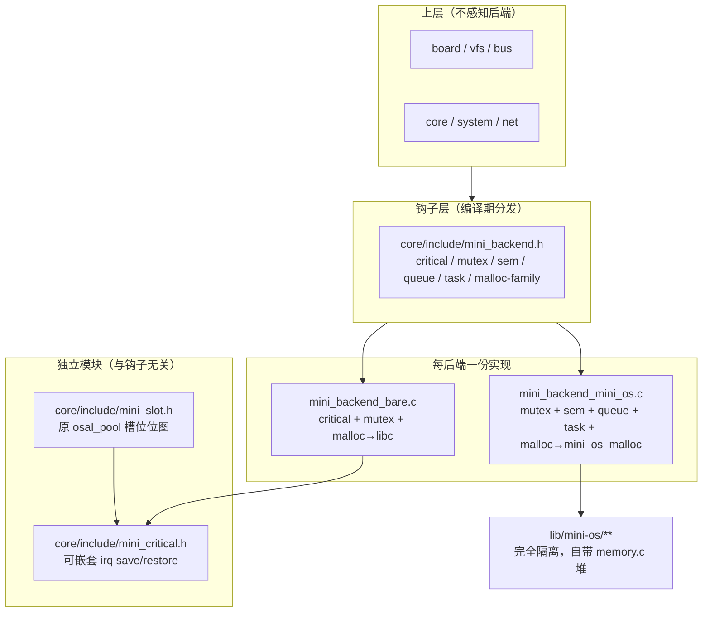

## 需求概述
移除 mini_tree 中名为 OSAL（操作系统抽象层）的一整层"伪 OS 抽象"，让上层（board / VFS / bus / core / system / net）直连后端；主树只保留 mini-os 与裸机两个后端，FreeRTOS / RT-Thread 的适配下沉到本地 Kconfig 扩展；同时清理与本次改造无关但已被判定为孤儿的模块。

## 核心功能

### 1. 删除 OSAL 抽象语义
- 删除 `osal/` 整目录（5 个后端实现文件、3 个公共头、1 个 C++ 任务封装、构建脚本）。
- 不再存在"平台无关 RTOS 接口"这一层；不存在 `osal_*` 命名空间。
- 原 OSAL 中与操作系统无关的公共设施（日志、panic/断言、时间、槽位池、错误码别名）按性质分别落到公共头，不做抽象。

### 2. 保留一个极薄的后端钩子
仅保留这些跨后端有差异的对象，每后端一份实现、一个公共头，编译期分发（不用运行时函数指针表）：
- 临界区（可嵌套中断保存/恢复）
- 互斥锁（需支持递归，静态存储）
- 二值信号量
- 定长消息队列（兼作网络层邮箱）
- 任务族（创建/自删除/删除/存活查询/取名/栈水位）
- 内存分配三个函数（分配、清零分配、释放）

裸机侧只提供临界区、互斥锁、内存三个函数；信号量、队列、任务在裸机下不存在，误用应在链接期报错。

### 3. 互斥锁必须按后端分发
- 互斥锁是唯一不能统一实现的同步原语，因为它的等待对象是需要 CPU 的对等任务，忙等会让出点失效、饿死持锁方。
- 裸机构建使用裸机自旋互斥锁；mini-os 构建使用内核互斥锁（带优先级继承）。
- 上层代码调用同一套接口，不感知差异。

### 4. 上层改造
- VFS / 设备层的每设备锁改用统一钩子类型，保持递归语义。
- 事件总线、系统任务管理、网络移植层全部改用钩子，不再包含 `osal_*` 调用。
- 清理 VFS 中只创建不使用的互斥锁字段。

### 5. 后端可选性
- 主树仍可通过配置选择后端（mini-os 或裸机）。
- FreeRTOS / RT-Thread 的配置项与构建分支移入本地扩展，通过 Kconfig 仍可选中。
- 嵌入式（ESP）构建保留其自带内核的绑定路径。

### 6. 连带清理
- 删除本仓已无任何调用点、且已独立成仓库的缓冲池模块及其配置项、构建引用、文档章节。
- 槽位池改名，消除与缓冲池、内核内存管理之间的"pool"命名歧义。
- 删除"裸机内存改走内核内存模块"的配置开关及其构建管道（该路径全仓无调用者，且全仓禁止动态分配）。
- 内核内存管理的 slab 层为不可达死代码，一并清理。

### 7. 顺手修复既有缺陷
- 网络移植层中把布尔返回值与成功码比较导致逻辑反转的三处缺陷。
- 文档中关于"堆无锁、ISR 内禁止调用"的错误描述。

## 视觉/交互效果
无界面变化。改造目标是源码结构、构建配置与文档的一致性：删掉一层被判定为无意义的抽象，让"后端差异"从一百多个接口收敛到十几个函数，并且改动过程与结果都可被逐阶段验证。


## 技术栈

沿用现有工程栈，不引入新依赖：

- 语言：C99（`-std=gnu11`）+ C++（ETL，`-fno-rtti -fno-exceptions`），freestanding（无 libc 依赖的内核侧）
- 构建：CMake 3.16+（`cmake/` 下的 `*.cmake` 模块 + 根 `CMakeLists.txt`），另有 ESP-IDF 组件路径（`cmake/esp_idf.cmake`）
- 配置：Kconfig，经 `tools/genconfig.py`（kconfiglib，`tools/_vendor` 内置）求值并回写 `.config` + 生成 `generated/kconfig/mini_tree/config.h`
- 目标：ARM Cortex-M（M0/M3/M4F/M7）为主，RISC-V / Xtensa(ESP) 走各自路径
- 内核：`lib/mini-os`（自研，Cortex-M 抢占式）+ 裸机 xtask（`time_slice/task/xtask_coop.c` 或 `xtask_preempt.c`）
- 静态检查：`compile_flags.txt`、`ide/stubs/config.h`、`tools/gen_compile_db.py`

## 实现方案

### 总体策略

把 OSAL 拆成三类，**分别处理而不是整体重写**：

1. **与 OS 无关的公共设施（占比最大，约 80% 调用点）** → 纯搬迁 + 改名，零语义变化。
2. **真 OS 语义（占比小，约 8~10 个文件）** → 收敛到每后端一个 `.c` 的钩子，编译期分发。
3. **只有 mini-os 才有的东西（事件组、内核 spinlock 全套、tick 类型）** → 直接删。

### 关键决策与理由

**决策 1：钩子用编译期分发（头文件 + 每后端 `.c`），不用函数指针表。**
`board/src/board_device.c:79-121` 的 `device_tree_init()` 在启动期创建锁；函数指针表会引入"表必须先于第一次 `device_open` 装好"的隐式顺序契约。编译期分发彻底消除这个风险，且 `device_read/write/ioctl` 热路径上省掉一次间接调用。

**决策 2：互斥锁必须按后端分发，一套裸机忙等锁不能通吃。**
判据不是"OS vs 裸机"，而是**锁的等待对象是否需要 CPU**：
- `sem` / `queue` 等的对象是 ISR 或必然推进的事件（中断照常触发，不受调度影响），忙等成立；mini-os 下改阻塞是等价替换。
- `mutex` 等的对象是**需要 CPU 的对等任务**，忙等方不放弃 CPU → 对方拿不到 CPU。

这条在 mini-os 下真实可触发，因为 `osal/src/osal_mini_os.c:730-739` 的 `osal_delay_ms` 会**让出调度器**（`mini_os_thread_delay_ms`），而 `osal/src/osal_null.c:422-448` 的裸机版是 WFI 忙等**不让出**。而驱动恰在持锁区间内调它：`board/src/board_device.c:716-726` 持锁调 `pdev->ops->write`，`drivers/bmp280/src/bmp280_drv.c:207,316` 各有 `osal_delay_ms(10)`。
后果链：高优先级等待方自旋不 yield → mini-os 严格优先级下持锁方永不被调度 → 100 ms（`OSAL_LOCK_TIMEOUT_DEFAULT_MS`，`osal/include/osal.h:35-37`；`board/src/board_device.c:861` 使用）后返回 `MINI_ERR_BUSY`，即"空转烧 100 ms CPU 且 I/O 随机失败"。

补充澄清（避免误伤）：裸机 `XTASK_PREEMPT` 名字叫抢占式但**不含回调内抢占** —— `time_slice/task/xtask_preempt.c:404-443` 的 `x_task_run_preempt` 在主循环内直接调用回调、run-to-completion；SysTick ISR（`:312` → `:388-397` `x_scheduler_tick`）只做 `tick_count += ms` 与 `wakeup_due()`，**不切上下文**。故裸机忙等锁在 `XTASK_PREEMPT` 下同样安全。

**决策 3：内存管理不搬运，只保留 3 个分发函数。**
`osal_malloc/calloc/free` 全仓（排除 osal 自身）**零调用点**，且全仓通过 `core/include/compiler_compat_poison.h:37` 的 `#pragma GCC poison malloc calloc realloc free` 禁止动态分配（豁免宏 `ALLOW_HEAP_ALLOC`，见 `:36`）。
而现实现本就是分发：`osal/src/osal_null.c:485-521`（开关开启走 `mini_os_malloc`，否则 libc）、`osal/src/osal_mini_os.c:786-799`（直接转发）。
唯一把 900 行 `memory.c` 拖成独立副本的是 `CONFIG_OSAL_NULL_MINI_OS_MEM`；删掉它即回归纯分发。
另：`lib/mini-os/` 的内核**强依赖自带堆**（`thread.c:423,427,529,530`、`queue.c:101,105,160,161`、`semaphore.c:103,122,266`、`mutex.c:200,219,634`、`timer.c:187,193,356`），故 `lib/mini-os/` 一字不动，也不做反向依赖或薄转发。

**决策 4：mini-os 的 slab 层直接砍掉（若将来搬运）。**
`CONFIG_OPEN_SLAB` / `CONFIG_MINI_OS_SLAB_*` / `CONFIG_MINI_OS_MEMORY_*` 全仓（排除 build）只出现在 `lib/mini-os/inc/memory.h`、`inc/mem_heap.h`、`src/memory.c` 三处，且 `lib/` 下无任何 Kconfig 文件声明它们 → 不可达代码。

**决策 5：`osal_pool` 改名 `mini_slot`，落到 `core/`。**
它不是内存分配器，是槽位位图（`osal/src/osal_null.c:225-292`，纯关中断，零后端差异），却被 ~55 个文件使用。不改名会与"缓冲池 / 内核内存管理"继续歧义。

**决策 6：非嵌套的 `hal_irq_disable_all/restore` 保留不动。**
`hal/amp/hal_amp.h:139-152` 是直接写 PRIMASK 的**非嵌套**版本，服务于 fail-fast / 安全停机路径；VFS/驱动需要的是**可嵌套**版。两者不可合并。可嵌套版的正确来源是 `osal/include/osal_null.h:53-85`（保存/恢复现场）与 `lib/mini-os/inc/critical.h:26-31` 的 `MINI_OS_ENTER_CRITICAL_STRICT()` = `mini_os_irq_save()`（`lib/mini-os/inc/redef.h:178` 注释 "exit nestable critical section, restores saved state"）——**两者语义一致**，正是要统一的那一份。

### 性能与可靠性

- 热路径：钩子为 `static inline` 头文件分发，无额外调用开销；比现状（`osal_mutex_lock` 一层外层函数 + 类型分发）更快。
- 无动态分配引入：本次改造不新增任何堆使用；`malloc-family` 仅保持现状分发。
- 存储尺寸：互斥锁槽位尺寸取 **128**（`board/include/board_config.h:70-72` 覆盖了 `osal/include/osal.h:202-204` 的 96，生效值是 128），由 `board/src/board_device.c:37` 的静态数组 `s_device_lock_storage[DEV_ID_COUNT][...]` 消费。
- 删掉 OSAL 后可回收：`osal` 静态库全部（约 190 KB 源码）、`mini_os_mem` 静态库（`osal/CMakeLists.txt:98-116`）、`osal_task.cpp`。
- 编译期失败优于运行期：裸机侧不提供 sem/queue/task，误用即链接报错。

## 实现注意事项

### 必须逐条落地、否则会坏的硬约束

1. **device 锁必须递归。** `board/src/board_device.c:642-671` 的 `device_open` 持锁后调用 `device_set_status`，后者在 `:541` 再次锁同一把；`device_close/suspend/resume` 同理。创建处注释已写明（`:94` `/* pdev->lock 需要递归 */`）。
2. **mini-os 递归锁用独立 API。** 必须用 `mini_os_mutex_recuring_create_static(name, mutex)`（`lib/mini-os/inc/mutex.h:94`），**不能**用 `mini_os_mutex_create_static()`（`:68`）——非递归版对同 owner 重入返回 `MINI_OS_ERR_BUSY`（`:103-104`），会直接把 `device_open` 打成失败。
3. **ms→tick 转换不能丢。** `mini_os_mutex_lock` 收 tick 不收 ms（`lib/mini-os/inc/mutex.h:116`），宏为 `MINI_OS_MS_TO_TICK`（`lib/mini-os/inc/schedule.h:32`）；裸机是 1:1（`osal/src/osal_null.c:463`）。现状由 `osal_mini_os.c:526` 处的 `osal_mini_os_timeout()` 承担，搬迁时必须一并带走。
4. **ISR 守卫改用 `hal_is_in_isr()`。** `hal/amp/hal_amp.h:55-69` 已是通用实现（IPSR / mcause）。已核实 `osal_null_isr_enter/exit`（`osal/src/osal_null.c:136-145`，声明 `osal/include/osal_null.h:41,46`）**全仓无任何调用点** → `s_isr_nest` 恒为 0 → 裸机 `osal_in_isr()` 实际只靠 IPSR。故那套嵌套计数不必搬。
5. **`ALLOW_HEAP_ALLOC` 豁免。** 钩子的裸机实现文件必须在 include poison 头之前 `#define ALLOW_HEAP_ALLOC`（照抄 `osal/src/osal_null.c:21-22`），否则 `malloc/calloc/free` 被 poison 编译失败。同时更新 `core/include/compiler_compat_poison.h:25` 的豁免名单注释（原文为 `printf_output.c, osal_freertos.c, osal_null.c, osal_rtthread.c`）。
6. **`algorithm/buffer/buffer.h` 不是 `buffer_pool.h`，不可误删。** 前者是 fifo_spsc / double_buffer，有 11 个文件在用（`vfs/i2s`、`vfs/dac`、`hal/adc`、`hal/dac`、`osal/src/osal_null.c`、`net/port/tcp/tcp_server.c`、`net/port/tcp/tcp_client.h`、`bus/usb/usb_net_cb.c`、`algorithm/buffer/double_buffer.c`、`algorithm/buffer/circle_fifo_buffer.c`、`interrupt/interrupt.h`）；后者才是待删的孤儿。
7. **网络移植层三处缺陷要一并修。** `osal_queue_send/receive` 返回 `bool`（`osal/include/osal.h:536,552`），而 `net/sys/sys_arch.c` 与 `OSAL_OK`（=0，`core/include/status.h:22,53`）比较：`:158` 返回值反转（成功→`ERR_MEM`，失败→`ERR_OK`）、`:229` 使 `sys_arch_mbox_fetch` 永返 `SYS_ARCH_TIMEOUT`、`:248` 使 `sys_arch_mbox_tryfetch` 永返 `SYS_MBOX_EMPTY`。改钩子时必须同步修正。
8. **裸机侧只需 critical + mutex + malloc。** sem / queue / task 的实现全在 `net/sys/sys_arch.c:29-254` 的 `#if NO_SYS == 0` 内；`Kconfig.mini_tree:1655-1669` 保证裸机 `SYS=y`（`NO_SYS=1`）、mini-os 默认 `SYS=n`（`NO_SYS=0`）。故裸机 `.c` 不提供这三类，误用即链接报错。
9. **ESP 构建必须单独安排路径。** `cmake/esp_idf.cmake:15` 读了 `CONFIG_OSAL_ENTRY` 但**全文未使用**，`:60-62` 硬编码 FreeRTOS 后端；且 ESP 下 `lib/` 不参与构建（根 `CMakeLists.txt:13-51` 在 `ESP_PLATFORM` 时 `include(esp_idf.cmake); return()`，故 `:604` 的 `add_subdirectory(lib)` 不执行，ESP 用的是 IDF 的 `freertos` 组件，见 `cmake/esp_idf.cmake:352` 的 `REQUIRES freertos`）。同时 `Kconfig.mini_tree:105` 明确 `OSAL_MINI_OS depends on !PLATFORM_RISCV && !PLATFORM_ESP32`。→ 删 `osal_freertos.c` 后 ESP 必须保留一条绑定路径，不是"改个 Kconfig"能解决。

### 影响面控制

- **单阶段可独立构建**：每阶段结束后必须能通过 `MINI_OS` 与 `NULL+XTASK_COOP` 两配置的全量构建，再进入下一阶段。禁止把多个阶段合并成一次大改。
- **不扩大范围**：不顺手重构驱动逻辑、不改 `lib/mini-os/**`、`lib/freeRTOS/**`、`lib/rtthread/**` 的源码内容（仅允许调整 CMake 门控与 Kconfig 声明）。
- **既有缺陷单独处理并留痕**：D8（`vfs/gpio/vfs-gpio.c` 的 `io_mutex` 只创建/销毁、中间无 lock/unlock，是近乎死代码）、D13（`Kconfig.mini_tree:190-191` 说"堆无锁、ISR 内禁止调用"，与 `lib/mini-os/inc/memory.h:178-179` 及 `lib/mini-os/src/memory.c:528,570,612` 的可嵌套关中断事实矛盾）、D14（mbox bug）必须显式列出并单独提交，不得静默顺手改。
- **命名波及要一次性做完**：`OSAL_*` 宏在 CMakeLists 23 处、`Kconfig.mini_tree` 10 处、`lib/*/CMakeLists.txt` 各 4 处、`ide/stubs/config.h` 6 处、`cmake/esp_idf.cmake` 2 处、`tools/*` 2 处、`compile_flags.txt` 2 处；文档约 20 篇。改名必须与删除同步，否则残留的 `OSAL_*` 符号会成为后续误导源。

## 架构设计

### 目标分层



### 组件关系要点

- **钩子层是唯一允许出现后端差异的地方**（1 个头文件 + 2 个 `.c`）。
- **`mini_critical.h` 是一份实现、三处共用**：`mini_slot`、钩子裸机版的 mutex 自旋临界区、device 锁的裸机路径。
- **依赖方向保持单向**：`core → lib`（经 `lib/CMakeLists.txt:137-150` 的 INTERFACE 传递）。不引入 `lib → core` 反向依赖，因此不建 `mem/` 目录、不做薄转发。
- **后端选择链保持三段一致性**：`.config` → `config.h` → CMake 的 `file(STRINGS ...)` 正则。根 `CMakeLists.txt:109`、`:203-239`、`core/CMakeLists.txt:8-20`、`lib/CMakeLists.txt:34-53`、`system_cpp/CMakeLists.txt:10-18`、`cmake/esp_idf.cmake:15`、`osal/CMakeLists.txt:10-30` 共七处读同一份 `.config`，删 osal 时这些正则必须同步收窄。

### 数据流（锁路径，改造后）

设备打开/读写：上层 → `device_lock(pdev)` → 钩子 `mini_mutex_lock` → 裸机自旋 / mini-os 内核锁（带优先级继承）→ 驱动 I/O → `device_unlock`。递归重入由钩子的递归语义承接。

## 目录结构

### 删除

```
osal/                                    # [DELETE] 整目录
├── CMakeLists.txt                       # [DELETE] 后端六分支 + osal_task.cpp + mini_os_mem 库
├── include/osal.h                        # [DELETE] ~94 个 API 声明 + log/panic/常量/池
├── include/osal_tick.h                   # [DELETE] 仅 osal 内部使用，无外部引用
├── include/osal_null.h                   # [DELETE] ISR 嵌套计数 + 可嵌套临界区 + C++ 任务重载
└── src/
    ├── osal_freertos.c                   # [DELETE]
    ├── osal_rtthread.c                   # [DELETE]
    ├── osal_mini_os.c                    # [DELETE]
    ├── osal_null.c                       # [DELETE]
    └── osal_task.cpp                     # [DELETE]

core/src/buffer_pool.c                    # [DELETE] 零调用孤儿
core/include/buffer_pool.h                # [DELETE] 零调用孤儿
```

### 新增

```
core/include/mini_backend.h               # [NEW] 唯一对外钩子头。声明 6 类对象：
                                          #   mini_critical_enter/exit（转发 mini_critical）
                                          #   mini_mutex_t + create_static / create_static_recursive / lock / unlock / destroy
                                          #   mini_sem_t + create_binary_static / wait / post / post_from_isr
                                          #   mini_queue_t + create / delete / send / send_from_isr / receive / receive_from_isr
                                          #   mini_task_*（create_handle / self_delete / delete / is_running / get_name / get_stack_watermark）
                                          #   mini_malloc / mini_calloc / mini_free
                                          # 常量：MINI_WAIT_FOREVER、MINI_LOCK_TIMEOUT_DEFAULT_MS(=100)、MINI_MUTEX_STORAGE_SIZE(=128)
                                          # 分发方式：#ifdef CONFIG_MINI_OS 选声明集；不使用函数指针表
core/src/mini_backend_bare.c              # [NEW] 裸机实现。需 #define ALLOW_HEAP_ALLOC。
                                          #   内容：mini_mutex（从 osal_null.c:150-787 搬，含 CONFIG_AMP_MODE 两套分支）、
                                          #        malloc/calloc/free → libc；
                                          #   不提供 sem/queue/task（裸机下无调用点，误用链接报错）
core/src/mini_backend_mini_os.c           # [NEW] mini-os 实现。
                                          #   内容：mini_mutex → mini_os_mutex_create_static / mini_os_mutex_recuring_create_static，
                                          #        超时用 MINI_OS_MS_TO_TICK；mini_sem → mini_os_binary_semaphore_create_static 等；
                                          #        mini_queue → mini_os_queue_*；mini_task → mini_os_thread_*；
                                          #        malloc/calloc/free → mini_os_malloc/calloc/free
core/include/mini_critical.h              # [NEW] 可嵌套中断保存/恢复。内容源自 osal_null.h:53-85，
                                          #   语义对齐 lib/mini-os/inc/critical.h:26-31 的 MINI_OS_ENTER_CRITICAL_STRICT
core/include/mini_slot.h                  # [NEW] 原 osal_pool 改名。槽位位图：init / claim / release / is_used
core/src/mini_slot.c                      # [NEW] 实现从 osal/src/osal_null.c:225-292 搬，临界区改用 mini_critical
```

### 修改（按模块）

```
# --- 构建与配置 ---
CMakeLists.txt                            # [MODIFY] :109 收窄正则；:203-239 删六分支/osal_task.cpp/memory.c；
                                          #          :456-463 去 buffer_pool.c；:555 去 osal/include；:579-585 删 mini-os/inc 暴露块
core/CMakeLists.txt                       # [MODIFY] :8-20 后端读取收窄；:27-33 删 buffer_pool 门控；:47 去 osal 依赖
lib/CMakeLists.txt                        # [MODIFY] :34-53 收窄为 MINI_OS/NULL；:63-92 移出 FreeRTOS/RT-Thread 分支；:137-150 同步
cmake/esp_idf.cmake                       # [MODIFY] :15 删未使用变量；:60-62 改为引用新钩子；:311 去 osal/include；:403 去 OSAL_DEFINE
system_cpp/CMakeLists.txt                 # [MODIFY] :10-18 收窄后端分支
lib/freeRTOS/CMakeLists.txt               # [MODIFY] 4 处 CONFIG_OSAL_* → 新符号
lib/rtthread/CMakeLists.txt               # [MODIFY] 4 处同上
lib/mini-os/CMakeLists.txt                # [MODIFY] :40-58 的 CONFIG_OSAL_EVENT 兜底改为 CONFIG_MINI_OS_EVENT 单条件
Kconfig.mini_tree                         # [MODIFY] :93-148 只留 MINI_OS/NULL；:150-224 OSAL_NULL_* 改名或删；
                                          #          :178-203 删 OSAL_NULL_MINI_OS_MEM；:226-336 删 OSAL_EVENT；
                                          #          :736-757 迁 OSAL_NULL_TASK_CPP；:964-1012 删 OSAL Spinlock 菜单；
                                          #          :1451-1521 删 BUFFER_POOL 段；:1570-1573 迁/删 OSAL_MUTEX_POOL_SIZE；
                                          #          :1655-1669 / :1676-1679 / :1762-1766 更新 lwIP 侧后端条件
Kconfig.local                             # [MODIFY] 新增 LOCAL: RTOS Backend 段（FreeRTOS / RT-Thread 选择 + 其内核参数）
Kconfig.non_esp                           # [MODIFY] 确认 Kconfig.local 的 source 方式
ide/stubs/config.h                        # [MODIFY] :22,23,30,31,36,37 的 OSAL_* 改名/删除
compile_flags.txt                         # [MODIFY] 去 osal/include
tools/gen_compile_db.py                   # [MODIFY] 去 osal 引用
tools/genconfig.py                        # [MODIFY] 如涉及 OSAL 符号回写则同步

# --- 底层公共设施 ---
core/include/status.h                     # [MODIFY] OSAL_OK / OSAL_ERR_* 别名去掉或保留为过渡；新增所需常量
core/include/compiler_compat_poison.h     # [MODIFY] :25 豁免名单注释更新
core/include/compiler_compat.h            # [MODIFY] :859 注释去掉 "同 core/src/buffer_pool.c"
core/include/system_log.h                 # [MODIFY] :17-26 日志级别枚举独立定义；:36-48 与 :73-88 的 osal_log 调用改新接口
core/include/mini_panic.h                 # [NEW] 承载 OSAL_PANIC / MINI_CRITICAL_ASSERT 的替代宏（从 osal.h:736-795 迁）
core/src/mini_log.c + core/include/mini_log.h   # [NEW] 从 4 个后端比对后统一 osal_log / osal_log_fatal /
                                                #       osal_log_critical_assert（需选定一份实现为准）
core/include/mini_time.h                  # [NEW] mini_time_ms / mini_delay_ms / mini_delay_us（后端分发）

# --- board / vfs ---
board/include/device.h                    # [MODIFY] :159 struct osal_mutex* → mini_mutex_t*
board/src/board_device.c                  # [MODIFY] :18-21 include；:31 静态断言改名；:37 存储数组尺寸宏；
                                          #          :92-100 创建改 mini_mutex_create_static_recursive；
                                          #          :117-118 水位预警宏；:541,549-550 与 :855-874 加解锁
vfs/gpio/vfs-gpio.c                       # [MODIFY] :22 include；:33,42,338,360,399 —— 按 D8 评估直接删除 io_mutex 字段与创建/销毁
vfs/{adc,can,dac,i2c,i2s,iwdg,rtc,spi,tim,uart,usb,wwdg}/vfs-*.c  # [MODIFY] osal_pool_* → mini_slot_*；osal_delay_ms → mini_delay_ms；OSAL_WAIT_FOREVER → MINI_WAIT_FOREVER
bus/{can,i2c,i2s,spi,uart,usb}/*_bus.c    # [MODIFY] 同上（bus/usb/usb_net_cb.c 亦需处理）

# --- core / system ---
core/src/event_bus.c                      # [MODIFY] :35-40 优先级宏；:63-68 句柄类型与存储；:88,140,150,223,225,301,318 队列；
                                          #          :102,113,147,182,199 锁；:124,278,304,310,313 任务族
core/include/event_bus.hpp                # [MODIFY] :148-149 成员类型与存储
core/src/event_bus.cpp                    # [MODIFY] :47-49,77,94,150,163,173 同上
system_c/src/task_manager.c               # [MODIFY] :38 任务创建
system_c/src/system_scrubber.c            # [MODIFY] :91,100,145,164 任务族
system_c/src/system_wdt.c                 # [MODIFY] :122,126,131,134 栈水位/取名；:159,173 订阅接口签名
system_c/include/task_manager.h           # [MODIFY] :29,41 句柄类型与注释
system_c/include/system_init.h            # [MODIFY] :17-29 启动示例注释与任务创建说明
system_cpp/src/task_manager.cpp           # [MODIFY] :19,28,29,43,55,63 任务创建
system_cpp/src/system_scrubber.cpp        # [MODIFY] :91,101,149,160 任务族
system_cpp/src/system_wdt.cpp             # [MODIFY] :94,99,106,112,128,137
system_cpp/src/system_init.cpp            # [MODIFY] :180 注释
system_cpp/src/system_cmd.cpp             # [MODIFY] :18-19,54,90,125,168,184 spinlock → mini_mutex（或 mini_critical）
system_cpp/include/task_manager.hpp       # [MODIFY] :26,30
system_cpp/include/system_wdt.hpp         # [MODIFY] :21,22,30
system_cpp/include/system_cmd.hpp         # [MODIFY] :224-225,276,332,383 spinlock 类型与存储

# --- net ---
net/arch/sys_arch.h                       # [MODIFY] :23 include；:30-33 句柄 typedef；:35-39 sys_* 映射
net/sys/sys_arch.c                        # [MODIFY] :25-27 临界区来源；:56,58 protect/unprotect；:76..250 sem/mutex/mbox/thread；
                                          #          并修复 :158 / :229 / :248 三处缺陷
net/lwipopts.h                            # [MODIFY] 仅在需要时同步 MEM_LIBC_MALLOC 相关注释

# --- 驱动（机械替换，共 37 个）---
drivers/*/src/*_drv.c 与 drivers/*/src/*_core.c   # [MODIFY] osal_pool_* → mini_slot_*；osal_delay_ms → mini_delay_ms；
                                                  #          OSAL_WAIT_FOREVER → MINI_WAIT_FOREVER；OSAL_MUTEX_STORAGE_SIZE 等宏改名

# --- 文档 ---
docs/cn/osal_removal_plan.md              # [NEW] 本计划
docs/{cn,en}/osal_switching.md            # [MODIFY] 按新后端模型重写或改名为 backend_switching.md
docs/{cn,en}/{patterns,getting_started,device_tree_porting,mini-os,memory_footprint,architecture,api_compatibility,amp,faq,driver_guide,service_spec,references,SUMMARY,file_index,problem_summary,ecosystem,keil_integration,usb_tusb_port,runtime_services}.md   # [MODIFY] 约 20 篇
docs/{cn,en}/{service_spec,runtime_services,file_index,architecture}.md  # [MODIFY] 去掉 buffer_pool 章节（8 处）
README.md                                 # [MODIFY] 后端表、Ecosystem 清单
CHANGELOG.md                              # [MODIFY] 记录本次改造
```

## 关键代码结构

仅给出钩子头这一处最关键的不透明契约（其余为实现细节，不在此展开）：

```c
/* core/include/mini_backend.h —— 唯一对外钩子 */
#ifndef MINI_BACKEND_H
#define MINI_BACKEND_H

#include <stddef.h>
#include <stdint.h>
#include "status.h"

#define MINI_WAIT_FOREVER            UINT32_MAX
#define MINI_LOCK_TIMEOUT_DEFAULT_MS 100U     /* 原 OSAL_LOCK_TIMEOUT_DEFAULT_MS */
#define MINI_MUTEX_STORAGE_SIZE      128      /* 原 OSAL_MUTEX_STORAGE_SIZE=96, 板级覆盖为 128 */

/* --- 互斥锁（静态存储；必须支持递归） --- */
typedef struct mini_mutex mini_mutex_t;
int  mini_mutex_create_static(mini_mutex_t** out, void* storage, size_t storage_size);
int  mini_mutex_create_static_recursive(mini_mutex_t** out, void* storage, size_t storage_size);
int  mini_mutex_lock(mini_mutex_t* mtx, uint32_t timeout_ms);
int  mini_mutex_unlock(mini_mutex_t* mtx);
void mini_mutex_destroy(mini_mutex_t* mtx);

/* --- 内存（保持现状分发语义） --- */
void* mini_malloc(size_t size);
void* mini_calloc(size_t count, size_t size);
int   mini_free(void* ptr);

/* --- 仅 mini-os 提供：sem / queue / task（裸机下不声明，误用即链接报错） --- */
#ifdef CONFIG_MINI_OS
typedef struct mini_sem   mini_sem_t;
typedef struct mini_queue mini_queue_t;
typedef void*             mini_task_handle_t;
/* create/wait/post/post_from_isr、create/delete/send/receive/..._from_isr、
   create_handle/self_delete/delete/is_running/get_name/get_stack_watermark */
#endif

#endif /* MINI_BACKEND_H */
```


## Agent Extensions

### SubAgent
- **code-explorer**
  - Purpose: 在改造开始前与每个阶段收尾时做全仓符号扫描，产出 `osal_*` / `OSAL_*` 在非 `osal/` 目录下的定义与引用完整清单（按符号、按文件、按行号），并在每阶段结束后复核是否仍有残留。
  - Expected outcome: 一份可核对的基线清单，确保 ~98 个调用文件、55 个 `osal_pool` 调用文件、7 处后端选择正则、CMake 23 处 / Kconfig 10 处 / IDE stub 6 处宏引用全部被覆盖，不出现遗漏或误改。

### Skill
- **lsp-code-analysis**
  - Purpose: 对具体符号做语义级引用查找与定义跳转，尤其是被机械批量替换的高频符号（如 `osal_pool_claim`、`osal_mutex_create_static_recursive`、`osal_task_get_stack_watermark`）与类型（`struct osal_mutex*`），用于验证批量替换没有漏掉跨文件调用点，并确认 `osal_scheduler_start`、`osal_task_create` 这两个疑似无 in-tree 调用者的符号的真实引用情况。
  - Expected outcome: 每个待替换符号的引用集合可枚举、可核对；批量替换后引用数为零（除白名单）；对疑似孤儿符号给出确定结论，供决定保留或删除。
